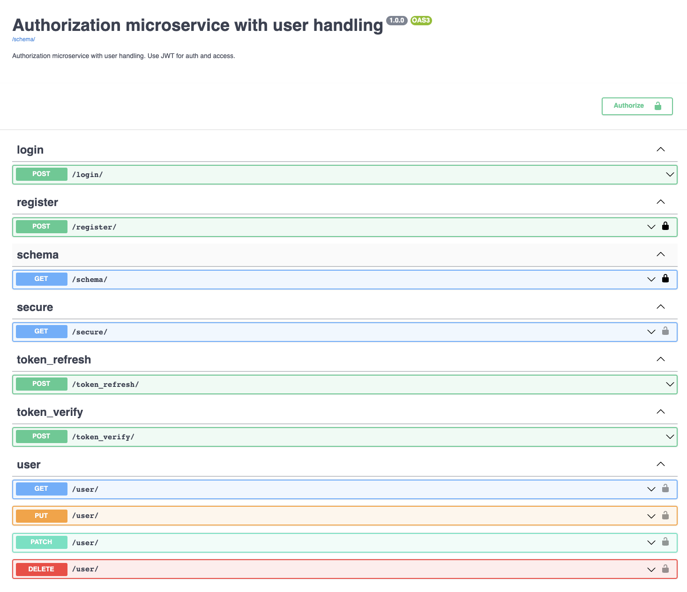

## About
Single service for user management and authentication within a microservice architecture; powered by Django Rest Framework (DRF).

### Installation
For local development next steps should be made:

```shell
virtualenv .venv --python=python3
source .venv/bin/activate
pip install -r requirements.txt
gunicorn auth_service.wsgi:application --bind 127.0.0.1:8000
# or
#   python manage.py runserver
```

### Usage
Following endpoints are available:
```
register/ - user registration
login/ - user login and JWT token retrievement
user/ - user account management (get/update/delete)
secure/ - test endpoint to check JWT token
token_verify/ - endpoint for other microservices
token_refresh/ - to refresh expired token with new one
```

### Technologies 
```
Python3.7+
Django==3.2.15
djangorestframework==3.14.0
drf-jwt==1.19.1
```

### Documentation
Swagger API and Postman Collectio is available within the project.
Visit root URL for accessing Swagger.


### Tests & Code Coverage
```shell
cd src
coverage run --source='.' manage.py test
coverage report
```